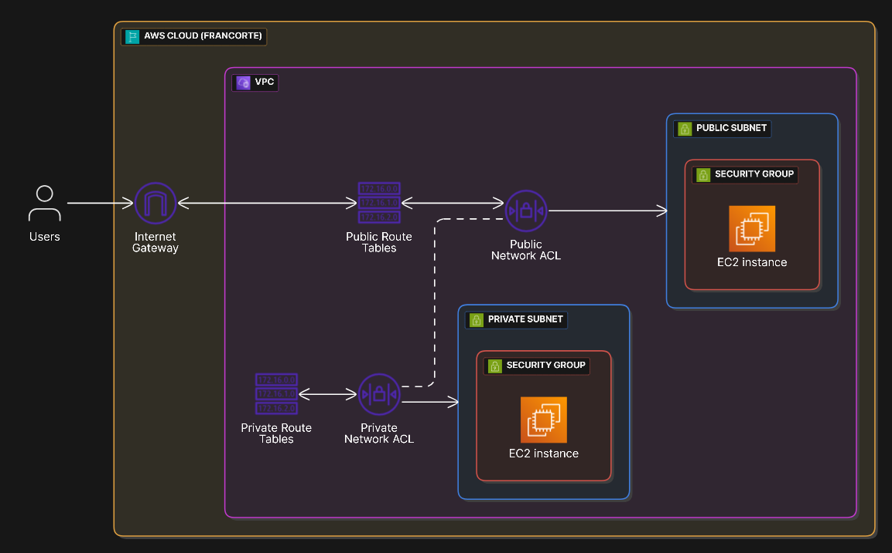

# VPC Ping Test

Una **VPC (Virtual Private Cloud)** è un modo per creare e gestire un'infrastruttura di rete virtuale su AWS, in cui gli oggetti possono comunicare tra loro attraverso regole di routing, controllo del traffico e configurazioni specifiche.  
Senza una VPC, le risorse AWS verrebbero allocate nello spazio condiviso del cloud, mentre con la VPC possiamo definire un ambiente isolato e controllato.

---

## Obiettivo del progetto

Implementazione completa di una Virtual Private Cloud (VPC) su AWS con tutte le componenti essenziali per il corretto funzionamento della rete, incluse subnet pubbliche e private, assegnazione IP automatica, collegamento con un Internet Gateway, e configurazione della comunicazione verso l’esterno.

---

## Fasi di sviluppo

### 1. Creazione della VPC

Ho inizializzato una VPC dal pannello di controllo AWS con le seguenti impostazioni:

- **Nome**: `Main VPC`
- **Blocco CIDR IPv4**: `10.0.0.0/16`

> Una maschera `/16` permette di riservare 16 bit per gli host (65536 indirizzi IP disponibili), facilitando la suddivisione in sottoreti (/24 o simili).

---

### 2. Creazione della Subnet

Ho creato una subnet, cioè una partizione della VPC, con le seguenti impostazioni:

- **Nome**: `Public Subnet`
- **Blocco CIDR**: `10.0.1.0/24`

- **Nome**: `Private Subnet`
- **Blocco CIDR**: `10.0.2.0/24`

> Una subnet `/24` fornisce 256 indirizzi IP (254 utilizzabili per host).

---

### 2.5. Nota sulle Availability Zones

Le **Availability Zones (AZ)** sono data center separati ma connessi all'interno di una regione geografica.  
Nel mio caso, la regione scelta è **Europa (Francoforte)** – [maggiori info sulle regioni AWS](https://aws.amazon.com/it/about-aws/global-infrastructure/regions_az/).

---

### 3. Abilitazione dell’assegnazione IP automatica

Per far sì che le risorse create all’interno della subnet ricevano automaticamente un IP pubblico, ho modificato le impostazioni della subnet:

- **Assegnazione automatica di indirizzi IP pubblici**: **Abilitata**

---

### 4. Creazione dell’Internet Gateway

Per permettere alla VPC di comunicare con Internet, ho creato un **Internet Gateway** con le seguenti caratteristiche:

- **Nome**: `Internet Gateway Main`

---

### 5. Collegamento Internet Gateway alla VPC

Una volta creato l’Internet Gateway, l’ho collegato alla VPC (`Main VPC`) tramite il pannello di controllo AWS.

---

A questo punto il setup di base è completo, prosegue in [Routing Table e Gestione del traffico](PART1.md)
